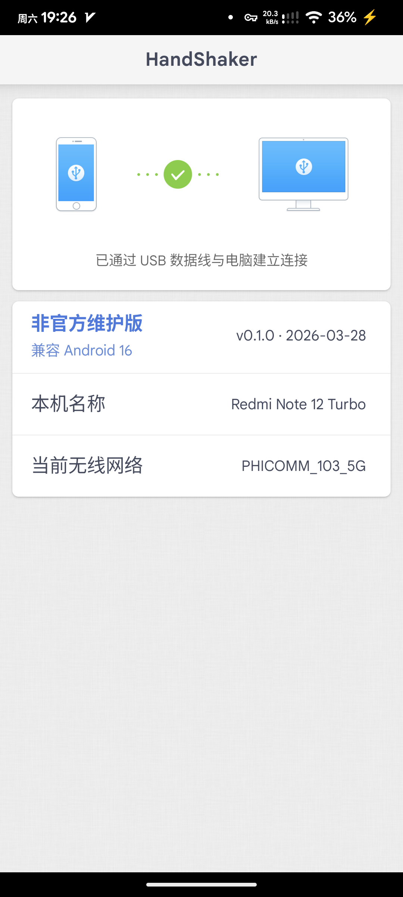
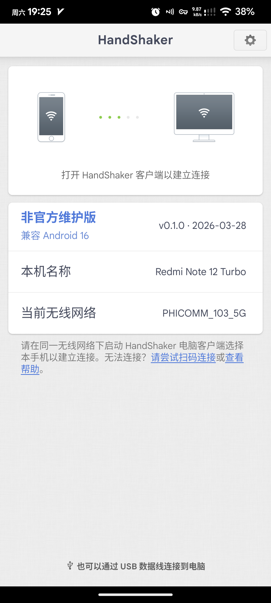

<div align="center">
  

  <h1>HandShaker Android Maintained</h1>

  <p><strong>面向新版 Android 的 HandShaker 非官方维护版</strong></p>
  <p>在保留原有连接体验的基础上，修复新版 Android 上的启动、权限、媒体访问与 USB 连接兼容问题。</p>

  <p>
    <a href="https://github.com/rianlu/handshaker-android-maintained/releases/latest">
      
    </a>
    
    
    
  </p>
</div>

> [!IMPORTANT]
> 本仓库是 HandShaker Android 的非官方维护项目，与原厂无官方关联。仓库内容主要用于个人学习、兼容性分析和非商业研究。详细说明见 [NOTICE.md](NOTICE.md)。

## 相关项目

- Android 端维护版仓库：当前仓库
- Mac 端维护版仓库：[handshaker-mac-maintained](https://github.com/rianlu/handshaker-mac-maintained)
- Mac 端最新发布页：[Latest Release](https://github.com/rianlu/handshaker-mac-maintained/releases/latest)

## 截图预览

<table>
  <tr>
    <td align="center" width="50%">
      
      <br />
      <strong>USB 连接已恢复</strong>
    </td>
    <td align="center" width="50%">
      
      <br />
      <strong>Wi-Fi 连接页与维护版标识</strong>
    </td>
  </tr>
</table>

## 项目亮点

- 修复 Android 16 上应用无法打开的问题
- 补齐定位、媒体读取、文件访问与 USB Accessory 的权限流程
- 修复新版 Android 上的媒体查询兼容问题
- 修复 USB 有线连接授权链路问题
- 修复连接页 Wi-Fi 名称显示异常问题
- **解锁剪切板功能**：通过硬编码 Smartisan 设备标识，使 Mac/Windows 客户端的剪切板 Tab 在任意 Android 设备上正常显示
- 保留原始结构，适合继续做后续兼容性维护

## 当前状态

- Android 端已经可以在新版系统上正常启动，并补齐了一批权限与连接兼容修复
- Windows 客户端已经实测可正常连接和使用
- Mac 端也已经独立完成维护修复，可前往 [handshaker-mac-maintained](https://github.com/rianlu/handshaker-mac-maintained) 获取可用版本
- APK 已加入“非官方维护版”视觉标识，便于与原版区分

## 已实测环境

- Redmi Note 12 Turbo / Evolution X / Android 16
- Xiaomi Pad 5 Pro / HyperOS 1.0.2.0 / Android 13

> [!NOTE]
> 当前仓库明确实测的是以上设备与系统组合。其他品牌、ROM、Android 版本以及不同桌面端环境下的表现可能存在差异，请不要默认视为所有设备都完全一致。

## 下载与使用

### 获取 APK

- 推荐直接前往 [Releases](https://github.com/rianlu/handshaker-android-maintained/releases) 页面下载已签名 APK
- 当前最新版本可在 [Latest Release](https://github.com/rianlu/handshaker-android-maintained/releases/latest) 获取
- 如果你需要 Mac 桌面端，请前往 [HandShaker Mac Maintained](https://github.com/rianlu/handshaker-mac-maintained) 下载对应 DMG

### 适用场景

- 如果你主要在 Windows 上使用 HandShaker，可以直接测试当前 APK
- 如果你主要在 macOS 上使用 HandShaker，建议搭配 [Mac 端维护版](https://github.com/rianlu/handshaker-mac-maintained) 一起使用

### Windows 使用建议

使用 USB 有线连接时，建议按下面顺序操作：

1. 手机插入电脑
2. 在手机 USB 选项中切换到“文件传输”
3. 等 Windows 先识别出设备
4. 再打开或重试 Windows 版 HandShaker

## 已修复问题

- Android 16 上应用无法打开
- 连接页 Wi-Fi 名称显示异常
- 部分定位、媒体读取、文件访问、USB Accessory 权限流程缺失
- 部分新版 Android 上的媒体查询兼容问题
- USB 有线连接授权链路问题
- **剪切板功能在非锤子设备上不显示**（Mac/Windows 桌面端通过 SSP 握手中的 `productBrand`、`productManufacturer`、`smartisanVersion` 字段判断是否为锤子设备，非锤子设备不展示剪切板 Tab；当前版本已在握手信息中硬编码为 Smartisan 标识，使剪切板 Tab 在任意 Android 设备上正常展示，PC→手机方向粘贴已可用）

## 仓库结构

- `smali/`：反编译后的 Android 逻辑代码
- `res/`：资源文件、布局、文案、图标
- `AndroidManifest.xml`：应用清单
- `tools/`：检查、构建、签名、发布相关脚本
- `assets/readme/`：README 展示截图

## 开发者说明

### 环境要求

- `apktool`
- JDK，且命令行可用 `keytool` 和 `jarsigner`
- `adb`

### 常用命令

先做兼容性检查：

```sh
./tools/check_install_compat.sh
```

本地调试构建并安装：

```sh
./tools/build_and_install.sh
```

构建 release APK：

```sh
sh ./tools/build_release.sh
```

### Release 版本维护

- 日常不要手动改 `apktool.yml`
- 版本入口统一在 `tools/release.conf`
- 修改 `RELEASE_SUFFIX` 和 `RELEASE_VERSION_CODE` 后，再运行 `sh ./tools/build_release.sh`
- release 构建产物会输出到 `build/release/`

### 后续二次修改建议优先查看

- `AndroidManifest.xml`
- `smali/com/smartisanos/smartfolder/aoa/MainActivity.smali`
- `smali/com/smartisanos/smartfolder/aoa/service/`
- `smali/com/smartisanos/smartfolder/aoa/d/`
- `res/`
- `tools/build_release.sh`
- `tools/release.conf`

## 图标与视觉标识

- 原始官方图标仍保留在 `res/drawable-*/ic_launcher.png`
- 当前清单改为引用 `@drawable/ic_launcher_custom`
- 维护版图标资源位于 `res/drawable-*/ic_launcher_custom.png`
- 仓库根目录的 `ic_launcher.png` 用于 README 与维护版视觉展示

## 友情链接

- [LINUX DO](https://linux.do/)
  社区文化：真诚、友善、团结、专业，共建你我引以为荣之社区。

## 版权与免责声明

- 原始应用及相关商标、名称、资源和版权归原权利人所有
- 本仓库不主张对原始应用本体及其相关知识产权拥有任何权利
- 当前仓库未对整体内容附加通用开源许可证
- 如你计划基于本仓库进行公开分发、商用集成或其他超出个人研究范围的用途，请自行评估相关风险
