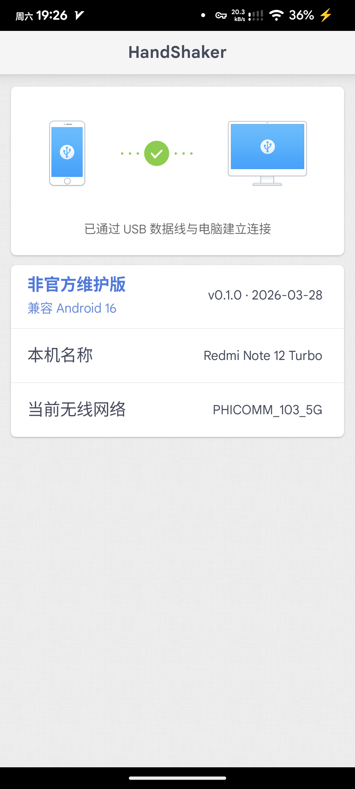
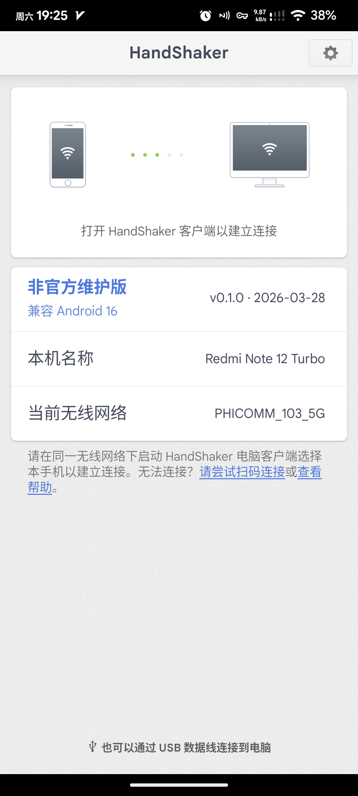

<div align="center">
  
  <h1>HandShaker Android Maintained</h1>
  <p>面向现代 Android 的 HandShaker 非官方维护版.</p>
  <p>
    <a href="https://github.com/rianlu/handshaker-android-maintained/releases/latest"></a>
    
  </p>
</div>

> [!IMPORTANT]
> 本项目与 HandShaker 原厂无官方关联, 仅用于兼容性维护, 学习和非商业研究. 详见 [NOTICE.md](NOTICE.md).

## 项目简介

本项目基于 HandShaker Android 客户端的反编译结果进行维护, 修复现代 Android 上的启动, 权限, 媒体访问, USB 连接和剪切板兼容问题.

<table>
  <tr>
    <td align="center"><br>USB 连接</td>
    <td align="center"><br>Wi-Fi 连接</td>
  </tr>
</table>

## 功能状态

- 支持现代 Android 系统启动和基础权限授权.
- 支持 USB 和 Wi-Fi 连接 HandShaker 桌面端.
- 修复媒体查询, Wi-Fi 名称显示和 USB Accessory 授权链路.
- 支持通过 GitHub Releases 检查和下载维护版更新.
- 在非锤子设备上显示桌面端剪切板页签, 支持电脑向手机写入剪切板.
- 在 HandShaker 主页面位于前台时, 支持将手机当前剪切板同步到电脑.

非锤子设备受 Android 10 及以上系统限制, 无法保证后台持续读取或同步多条剪切板历史. 原版锤子系统私有剪切板路径仍保留, 但当前缺少锤子设备进行回归验证.

## 下载与使用

从 [Releases](https://github.com/rianlu/handshaker-android-maintained/releases) 下载已签名 APK. 最新版本见 [Latest Release](https://github.com/rianlu/handshaker-android-maintained/releases/latest).

Windows USB 连接建议按以下顺序操作:

1. 打开手机端 HandShaker.
2. 使用 USB 数据线连接电脑.
3. 将手机 USB 用途切换为"文件传输".
4. 打开或重试 Windows 端 HandShaker, 并确认手机上的 USB 配件授权弹窗.

Mac 通常无需切换 USB 用途. 如无响应, 请重新插拔数据线并重试.

## 兼容性

已实测:

- Redmi Note 12 Turbo, Evolution X, Android 16.
- Xiaomi Pad 5 Pro, HyperOS 1.0.2.0, Android 13.

其他设备, ROM 和系统版本可能存在差异.

## 构建

环境要求:

- apktool.
- JDK, 包含 `keytool` 和 `jarsigner`.
- adb.

```sh
./tools/check_install_compat.sh
./tools/check_usb_connection_tip.sh
./tools/build_and_install.sh
./tools/build_release.sh
```

版本号统一在 `tools/release.conf` 中维护. 发布产物输出到 `build/release/`.

## 仓库结构

```text
.
├── smali/              # 反编译后的应用逻辑
├── res/                # Android 资源和文案
├── assets/             # 应用及 README 资源
├── original/           # 原始签名和清单参考
├── tools/              # 检查, 构建, 签名和发布脚本
├── AndroidManifest.xml
└── apktool.yml
```

## 相关项目

- [HandShaker Mac Maintained](https://github.com/rianlu/handshaker-mac-maintained)
- [HandShaker Windows Maintained](https://github.com/rianlu/handshaker-windows-maintained)

## 友情链接

- [LINUX DO](https://linux.do/): 真诚, 友善, 团结, 专业, 共建你我引以为荣之社区.

## 版权与免责声明

原始应用及相关名称, 商标, 代码和资源归原权利人所有. 本仓库不对原始应用主张权利, 未对整体内容授予通用开源许可证. 公开分发, 商业使用或二次集成前, 请自行评估相关风险.
